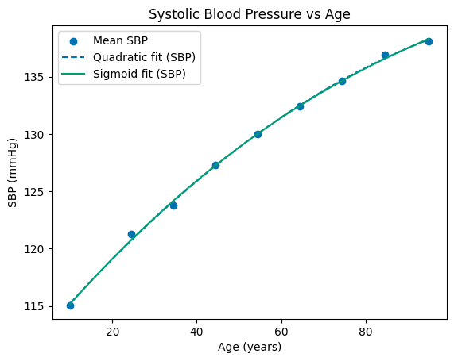
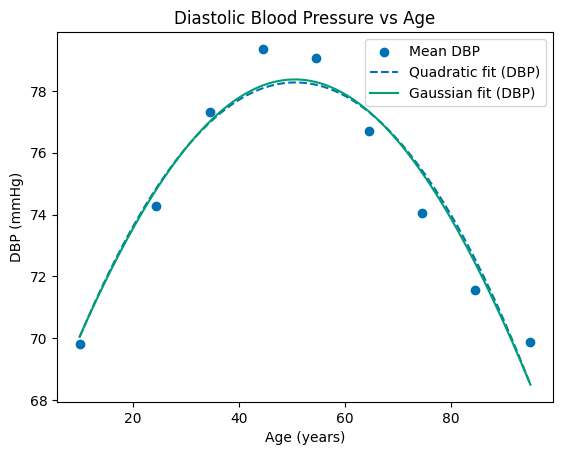
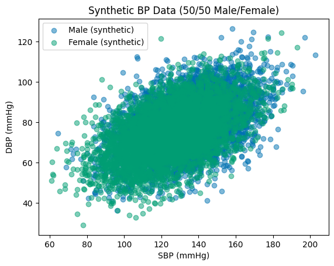
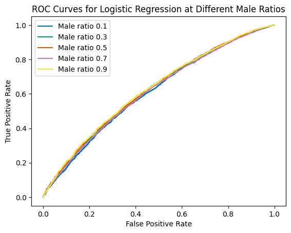
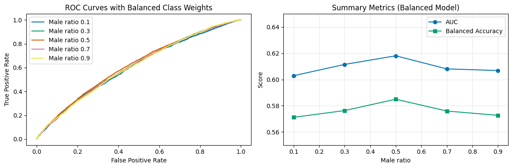
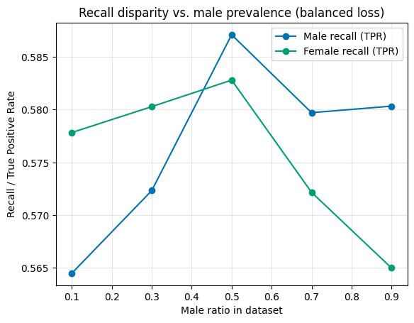

# Model-based Machine Learning Homework Submission

## Student Info
- Name: Xinliu Zhong
- Contact: xinliu.zhong@emory.edu

## Selected Question
- HW 3: Model-based Bias Removal in Machine Learning using Synthetic Blood Pressure Data

## Key Insights
- SBP/DBP trends from Table III are well captured by both quadratic and physiologically motivated sigmoid/Gaussian models (SBP MSE ~0.065 mmHg^2, R^2~0.999; DBP Gaussian MSE 0.801 mmHg^2, R^2 0.9341). The sigmoidal SBP inflection lies outside the observed ages, signposting where additional pediatric data would improve identifiability.
- A 400-draw bootstrap demonstrates that the SBP fits remain tightly clustered (MSE 0.042 +/- 0.03 mmHg^2, R^2 CI 0.997-1.000) and that the DBP Gaussian retains lower residuals than the quadratic model (MSE mean 0.447 vs. 0.500 mmHg^2), providing explicit uncertainty bounds.
- Synthetic SBP/DBP sampling via sex-specific bivariate normals (N=100k) recreates the desired means, variances, and correlations, which in turn allows precise prevalence sweeps for bias analysis.
- Unweighted logistic regression mirrors class prevalence: accuracy can rise to 0.90 while the minority's recall collapses to ~0, producing TPR gaps up to +/-0.99. Balanced accuracy/recall plots make this failure obvious.
- Class-weighted logistic regression (`class_weight='balanced'`) keeps both male and female recall within 0.56-0.60 and holds balanced accuracy near 0.58 across all prevalence ratios, showing that loss reweighting is an effective model-based mitigation.

## Comparative Model Performance

### Blood Pressure vs Age Fits
- Data: Table III mean SBP/DBP values across nine age midpoints were fit with both quadratic and nonlinear (sigmoid/Gaussian) models.
- Both SBP models achieve MSE ~0.065 mmHg^2 and R^2~0.999; the DBP Gaussian lowers the residuals compared to the quadratic fit (0.801 vs. 0.898 mmHg^2).
- The sigmoidal SBP inflection occurs before the observed age range, indicating that the logistic prior extrapolates and would benefit from pediatric data or a 4-parameter logistic model.

| Model | MSE (mmHg^2) | R^2 |
| --- | --- | --- |
| SBP (Quadratic) | 0.065 | 0.9988 |
| SBP (Sigmoid) | 0.065 | 0.9988 |
| DBP (Quadratic) | 0.898 | 0.9261 |
| DBP (Gaussian) | 0.801 | 0.9341 |

**Parameter Estimates**

| Parameter | Value | Unit |
| --- | --- | --- |
| c1 (SBP quadratic) | -0.001532 | mmHg/year^2 |
| c2 (SBP quadratic) | 0.431291 | mmHg/year |
| c3 (SBP quadratic) | 111.083789 | mmHg |
| d1 (DBP quadratic) | -0.004983 | mmHg/year^2 |
| d2 (DBP quadratic) | 0.505026 | mmHg/year |
| d3 (DBP quadratic) | 65.479662 | mmHg |
| Smax (SBP sigmoid) | 148.911 | mmHg |
| k (SBP sigmoid) | 0.01576 | 1/year |
| a0 (SBP sigmoid) | -67.94 | years |
| Dmax (DBP Gaussian) | 78.372 | mmHg |
| apeak (DBP Gaussian) | 50.57 | years |
| sigma (DBP Gaussian) | 85.57 | years |

**Bootstrap Sensitivity (400 resamples)**

| model | MSE_mean | MSE_std | MSE_ci_low | MSE_ci_high | R2_mean | R2_std | R2_ci_low | R2_ci_high |
|:----------------|-----------:|----------:|-------------:|--------------:|----------:|---------:|------------:|-------------:|
| SBP (Quadratic) | 0.042341 | 0.030132 | 0.0115 | 0.1029 | 0.9987 | 0.0009 | 0.9973 | 0.9999 |
| DBP (Quadratic) | 0.500431 | 0.312021 | 0.0870 | 0.9968 | 0.9580 | 0.0475 | 0.8865 | 0.9977 |
| SBP (Sigmoid) | 0.042311 | 0.028936 | 0.0121 | 0.0986 | 0.9987 | 0.0010 | 0.9972 | 0.9999 |
| DBP (Gaussian) | 0.447389 | 0.282413 | 0.0852 | 0.9964 | 0.9623 | 0.0448 | 0.8978 | 0.9979 |

### Synthetic BP Data Generation
- N = 100,000 samples drawn from sex-specific bivariate normals (means, standard deviations, and correlations from the homework brief).
- Allows explicit control over sex prevalence to probe imbalance-driven biases.

### Classification & Bias Analysis (Unweighted Logistic Regression)
- Logistic regression trained per prevalence setting (male ratios 0.1-0.9).
- Accuracy and F1 deceptively improve as soon as one class dominates because the classifier simply predicts the majority.
- Balanced accuracy and per-class recall reveal extreme unfairness: when males are only 10% of the data, male recall collapses to zero; when females are 10%, their recall collapses instead.

| Male Ratio | Accuracy | Balanced Acc. | F1 | AUC | Recall (Male) | Recall (Female) |
| --- | --- | --- | --- | --- | --- | --- |
| 0.10 | 0.900 | 0.500 | 0.000 | 0.610 | 0.000 | 1.000 |
| 0.30 | 0.700 | 0.507 | 0.050 | 0.618 | 0.026 | 0.989 |
| 0.50 | 0.585 | 0.585 | 0.586 | 0.622 | 0.587 | 0.582 |
| 0.70 | 0.702 | 0.512 | 0.822 | 0.613 | 0.987 | 0.037 |
| 0.90 | 0.900 | 0.500 | 0.947 | 0.625 | 1.000 | 0.000 |

*Observed Fairness Gap:* Accuracy mirrors class prevalence, so fairness metrics are essential; the true-positive-rate (TPR) gap swings from -0.98 (female advantage) at a 10% male share to +0.99 (male advantage) at a 90% male share.

### 4. Bias Mitigation via Class Weighting
- Logistic regression is retrained with `class_weight='balanced'`.
- ROC curves remain similar (showing separability is unchanged), but AUC and balanced accuracy stay flat across prevalence.
- Minority recalls stabilize near 0.58, shrinking the TPR gap to <0.04 even in extreme ratios.

| Male Ratio | Accuracy | Balanced Acc. | F1 | AUC | Recall (Male) | Recall (Female) |
| --- | --- | --- | --- | --- | --- | --- |
| 0.10 | 0.577 | 0.571 | 0.210 | 0.603 | 0.565 | 0.578 |
| 0.30 | 0.578 | 0.576 | 0.449 | 0.612 | 0.572 | 0.580 |
| 0.50 | 0.585 | 0.585 | 0.586 | 0.618 | 0.587 | 0.583 |
| 0.70 | 0.577 | 0.576 | 0.658 | 0.608 | 0.580 | 0.572 |
| 0.90 | 0.579 | 0.573 | 0.713 | 0.607 | 0.580 | 0.565 |

*Effect on Fairness:* Loss reweighting keeps recall for both sexes between 0.57 and 0.60 regardless of prevalence, demonstrating a simple yet principled bias mitigation aligned with the homework prompt.

---

## Relevance to Model-based Machine Learning
- The notebook encodes physiological priors (quadratic, sigmoid, Gaussian BP curves) directly from literature tables, yielding interpretable parameters.
- Synthetic data generation uses explicit probabilistic models to stress-test how prevalence affects downstream classifiers.
- Bias diagnostics (ROC curves, TPR gaps, balanced accuracy) demonstrate how model-based reasoning guides fairness interventions and loss design.

## Suggestions for Future Modeling Improvements
1. Incorporate age- and treatment-specific covariates (BMI, antihypertensive use) to extend the generative model beyond two vital signs.
2. Replace the static correlation assumption with copula-based sampling to encode potential non-linear SBP/DBP dependence.
3. Explore Bayesian hierarchical models that pool sex-specific parameters while allowing subgroup variations, then propagate posterior uncertainty through the classifier.
4. Evaluate threshold-tuning or cost-sensitive decision rules that explicitly optimize balanced accuracy under deployment prevalence.

## Repository Map
- `code.ipynb`: Executable notebook with modeling, simulation, fairness analysis, and mitigation experiments.
- `ai_prompts.md`: Transcript of the user prompts and AI responses for disclosure compliance.

## Reproduction & Tests
1. (Optional) Create a virtual environment: `python -m venv .venv && source .venv/bin/activate`.
2. Install dependencies: `pip install numpy pandas matplotlib scipy scikit-learn jupyter`.

## Generative AI Disclosure
- Disclaimer: ChatGPT (Codex) was used for refactoring and formatting; all modeling, simulations, metrics, and plots were authored, executed, and validated locally. The interaction log is archived in `ai_prompts.md`.
